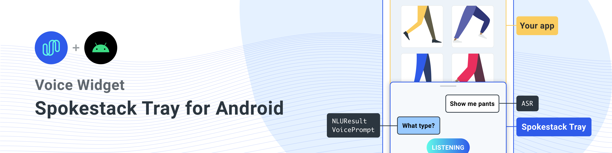
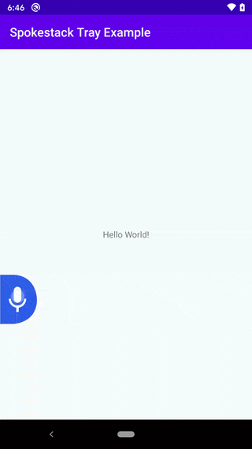

<a href="https://www.spokestack.io/blog/integrating-spokestack-in-android" title="Integrating Spokestack in Android"></a>

[ ](https://repo1.maven.org/maven2/io/spokestack/tray)
[  ](https://bintray.com/spokestack/io.spokestack/tray/_latestVersion)
[](https://opensource.org/licenses/Apache-2.0)

A `Fragment` for adding voice control via Spokestack to any Android app. You can find a simple demo app that shows the tray in action in the `example` directory.

## Table of Contents
* [Description](#description)
* [Usage](#usage)
* [Configuration](#configuration)
* [Customization](#customization)
* [License](#license)


## Description

When you add the Spokestack Tray Fragment to your layout, you'll get a microphone button shaped like a tab on the side of the screen (_which_ side it's on is up to you; more on that later). Tapping or dragging the tab reveals the rest of the tray, which is arranged like a messaging stream in a chat app. Opening the tray activates the microphone, and anything the user says will be sent through an automatic speech recognition (ASR) service and displayed as text. That text is then sent to a natural language understanding (NLU) model for classification. Results of the classification are sent to the application component you've established to listen to events from the tray, which can produce a response that the tray will both display and read to the user via Spokestack's text-to-speech (TTS) synthesis service. The microphone will be reenabled if the app's response directs it to; otherwise, the tray will close and disable ASR.

And just like that, you've added voice to your app!



Oh, and after that initial interaction, the tray can be opened with a wakeword instead of a tap. The wakeword is "Spokestack" by default, but [that can be customized](https://www.spokestack.io/docs/Concepts/wakeword-models).

If some of that didn't make sense, fear not! Read on, and we'll cover all the details below.

## Usage

By default, Spokestack Tray handles ASR, NLU, and TTS for voice interactions with users—that's converting their voice to text, processing that text to produce an action, and synthesizing the app's response to be read back to the user. For more information on these features, see [the Spokestack docs](https://www.spokestack.io/docs/Concepts).

To use NLU and TTS, you'll need a [free Spokestack account](https://www.spokestack.io/create). From your account page, you'll be able to create and download NLU models; and the client ID and secret key are needed at runtime for TTS requests.

First, though, add the dependency to your app's `build.gradle` (check the JCenter badge above for the latest version):

```groovy
implementation 'io.spokestack:tray:0.4.0'
```

As mentioned above, Spokestack Tray is implemented as a `Fragment` that renders on top of your existing `Activity` and handles voice interaction, so you'll want to add it to your activity's layout:

```xml
    <!-- nested in the main layout, after other views/sublayouts -->

    <include
        android:id="@+id/tray_fragment"
        layout="@layout/spokestack_tray_fragment"
        />
```

**Note**: Depending on your app layout, you may also have to add `android:clipChildren="false"` to the fragment's parent layout(s) to avoid the microphone tab disappearing as the tray opens.

Then make your activity itself extend `TrayActivity` (a subclass of `AppCompatActivity`), implement the methods it requires, and the library will take care of the rest.

If you'd prefer to do the setup yourself, here's a sample that doesn't use `TrayActivity`:

```kotlin
import io.spokestack.tray.*

class MyActivity : AppCompatActivity(), SpokestackTrayListener {

    lateinit var tray: SpokestackTray

    // ...

    override fun onCreate(savedInstanceState: Bundle?) {

        val config = TrayConfig.Builder()
            // credentials from your Spokestack account
            .credentials("spokestack-client-id", "spokestack-secret-key")
            .wakewordModelURL("https://path-to-wakeword-models")
            .nluURL("https://path-to-nlu-files")
            // note the implementation of `SpokestackTrayListener` in the class declaration
            .withListener(this)
            // optional builder customization; see the documentation for more details...
            .build()
        supportFragmentManager.fragmentFactory = SpokestackTrayFactory(config)

        // note that the factory is instantiated and set on the manager BEFORE calling
        // `super.onCreate()`
        super.onCreate(savedInstanceState)
    }

    override fun onStart() {
        // set the value of the lateinit `tray` var
        tray = SpokestackTray.getInstance(config)
        super.onStart()
    }
```

When you download Spokestack wakeword or NLU models, you'll have several URLs to different files. `wakewordModelURL` and `nluURL` above only require the path to the relevant directory, not full file URLs. So for the demo "Spokestack" wakeword, set `wakewordModelURL` to "https://d3dmqd7cy685il.cloudfront.net/model/wake/spokestack/".

The Tray is designed for seamless use across activities — for example, to allow a user to continue giving a voice command while the app switches activities — so its state is stored outside the fragment itself and survives fragment destruction. If your app needs to release resources held by the Tray and its underlying `Spokestack` instance, call the tray's `stop()` method. If you then need to re-enable voice control before the current Tray fragment instance is destroyed, you must call `start()`.

If you want to keep tray state intact after process death, you can store it in its parent activity's `onSaveInstanceState` and `onRestoreInstanceState` methods using the Tray's `getState()` and `loadState()` methods; see their documentation for more details.

### Responses

Chances are that if you're allowing the user to talk to your app, you want the app to talk back. Tray is integrated with Spokestack's TTS service, so synthesizing audio is just as easy as transcribing it.

When you extend `TrayActivity`, one of the methods you'll have to implement is `getTrayListener()`, which creates and returns a `SpokestackTrayListener`. This interface assists your app in reacting to events received and produced by the Tray. Because each use case is unique, all its methods are optional; the one we're interested in here is `onClassification`. This method is called after a user's speech has been transcribed by ASR and classified by NLU. It supplies your app with the NLU result and asks you to return a response:

```kotlin
override fun onClassification(result: NLUResult): VoicePrompt {
  return if (result.intent == "your-special-intent") {
    VoicePrompt("I hear you loud and clear")
  } else {
  VoicePrompt(
    "Sorry; I didn't catch that",
    expectFollowup = true)
  }
}
```

The optional second parameter in the `VoicePrompt` constructor lets the Tray know if you're expecting a response — if you are, it will resume active listening after your prompt is played so the user doesn't have to use the wakeword or a button for each interaction.

## Configuration

The above sample will get you up and running with minimal fuss, but it's far from all that Spokestack Tray offers. When you're building a `TrayConfig` instance, you can choose to configure and provide the underlying `Spokestack` builder itself. This will let you do things like change ASR providers, set up custom listeners for events from individual systems, and add custom speech processing components if you need to. You can read about the Spokestack builder [here](https://www.spokestack.io/docs/Android/turnkey-configuration).

There are also a range of options that are applicable to the Tray itself, accessible via helper methods on the `TrayConfig.Builder` instance. Describing each one here would make this readme...ponderous, though, so check out the [documentation](https://spokestack.github.io/spokestack-tray-android/-spokestack-tray/) for more details. Documentation on `TrayConfig.Builder` is [here](https://spokestack.github.io/spokestack-tray-android/-spokestack-tray/io.spokestack.tray/-tray-config/-builder**.


## Customization

Most aspects of the tray's UI can be customized. Often this is accomplished in XML by overriding values set in the library.

One exception to this is the tray's orientation: Its microphone button defaults to appearing as a right-facing tab on the lefthand side of the screen, with the tray consequently sliding in from the left. It also supports a righthand orientation but requires two changes in order to do so:

1. Call `.orientation(TrayConfig.Orientation.RIGHT)` on the `TrayConfig`builder before building the configuration.
1. Set appropriate layout parameters when including the tray Fragment in your layout. When the fragment is right-aligned to its parent, layout constraints in the tray's layout itself take care of the rest. Here's the example we gave above modified for a righthand orientation:
```xml
<include
  layout="@layout/spokestack_tray_fragment"
  android:layout_width="wrap_content"
  android:layout_height="wrap_content"
  app:layout_constraintBottom_toBottomOf="parent"
  app:layout_constraintEnd_toEndOf="parent" />
```

We only _need_ the last constraint here; the rest of the attributes are identical to the source layout. Since we're using `include`, though, overriding one attribute means overriding all of them; see the note at the end of the paragraph [here](https://developer.android.com/training/improving-layouts/reusing-layouts#Include).

Value-based UI customizations are listed below. The filenames here point to the original definitions in the library's `res/values` folder, but replacements can be defined elsewhere in your project. The example app illustrates this by overriding the text color for system messages in `res/values/custom_colors.xml`.

### `colors.xml`

* `spsk_colorTrayBg`: The background color used for the tray's message stream.
* `spsk_colorIcon`: The foreground color used for icons that need to contrast with `spsk_colorBrand`. Defaults to white.
* `spsk_colorDragHandle`: The color used for the tray's resizing drag handle.
* `spsk_colorBrand`: The primary color of UI elements like the microphone button and icons without a background.
* `spsk_colorListenText`: The color used for text in the "listening" bubble.
* `spsk_colorSystemText`: The color used for text in system message bubbles.
* `spsk_colorUserText`: The color used for text in user message bubbles.
* `spsk_colorSystemBg`: The background color used for system message bubbles.
* `spsk_colorUserBg`: The background color used for user message bubbles.
* `spsk_colorGradientOne`: The start color used for the listening gradient animation. Defaults to `spsk_colorBrand`.
* `spsk_colorGradientEnd`: The end color used for the listening gradient animation.
* `spsk_colorTransparent`: Transparent color used as the background tint for the "back" arrow on the tray.

### `dimens.xml`

* `spsk_micTabWidth`: Width for the microphone tab button. Defaults to `60dp`.
* `spsk_micTabHeight`: Height for the microphone tab button. Defaults to `80dp` and should be kept in a 4:3 ratio with `spsk_micTabWidth`.
* `spsk_listenBubbleWidth`: Width for the listening bubble that appears during ASR. Defaults to `120dp`and should be kept in a 2:1 ratio with `spsk_listenBubbleHeight`.
* `spsk_listenBubbleHeight`: Height for the listening bubble that appears during ASR. Defaults to `60dp`.
* `spsk_messageStreamHeight`: Starting height for the message stream inside the tray. Defaults to `100dp`.
* `spsk_messageStreamMinHeight`: Minimum height to which the tray can be resized by drag. Defaults to `80dp`.

### `ints.xml`

* `spsk_trayAnimateMs`: The amount of time, in milliseconds, the tray takes to open or close. Defaults to `500`.

### `strings.xml`

* `spsk_listening`: The text displayed in the tray during active listening (ASR). Defaults to `"LISTENING"`.

### `styles.xml`

* `spsk_messageFont`: The font family used to display ASR transcripts and system messages in the tray. Defaults to `sans-serif` (Roboto).


## License

Copyright 2020 Spokestack, Inc.

  Licensed under the Apache License, Version 2.0 (the "License");
  you may not use this file except in compliance with the License.
  You may obtain a copy of the License at

      http://www.apache.org/licenses/LICENSE-2.0

  Unless required by applicable law or agreed to in writing, software
  distributed under the License is distributed on an "AS IS" BASIS,
  WITHOUT WARRANTIES OR CONDITIONS OF ANY KIND, either express or implied.
  See the License for the specific language governing permissions and
  limitations under the License.
